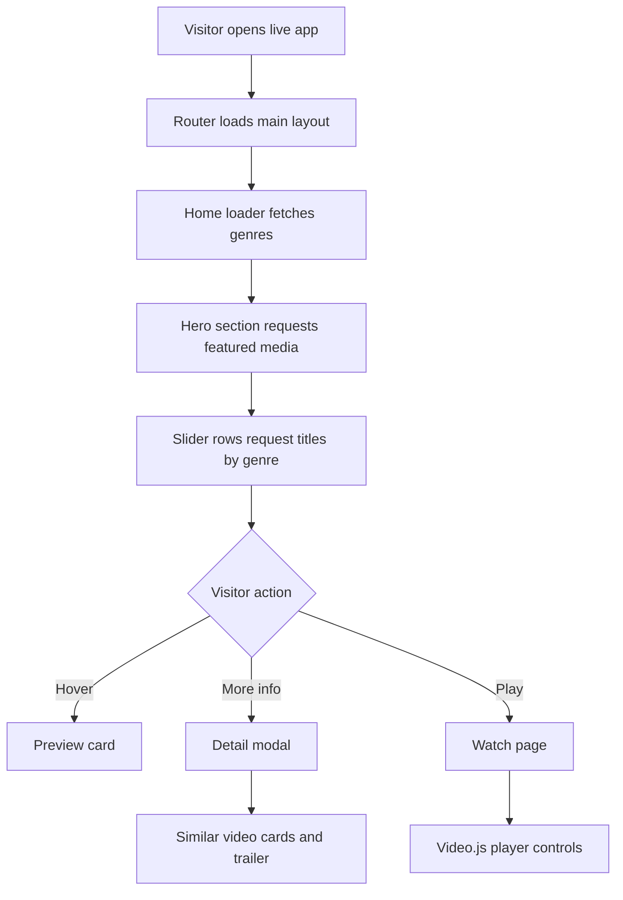
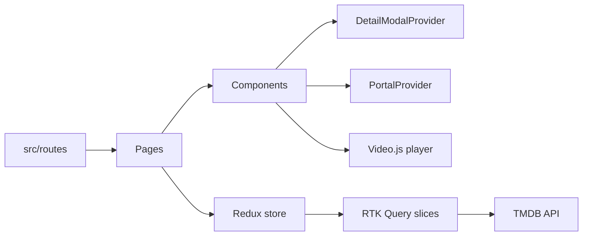

<div align="center">

# Netflix Clone

[](https://react.dev/)
[](https://www.typescriptlang.org/)
[](https://vitejs.dev/)
[](https://redux-toolkit.js.org/)

A Netflix inspired streaming UI with TMDB browsing, genre rows, detail modals, and a custom video player screen.

[Live site](https://netflix-ranjansharma.vercel.app/) | [GitHub repo](https://github.com/Konseptt/netflix-clone)

</div>

## Why I built this

I built this to practice a more complete streaming interface in TypeScript. The project has real route loaders, RTK Query data fetching, a modal provider, genre browsing, animated hover cards, and a watch page built around Video.js.

It helped me understand how many small pieces go into an interface that looks effortless.

## Preview


## What it includes

- Home page with hero media and genre sliders
- TMDB data fetching with Redux Toolkit Query
- Detail modal with trailer playback, metadata, and similar videos
- Genre explore page with infinite style grids
- Watch page with Video.js controls and seekbar UI
- Responsive Material UI layout
- Framer Motion transitions

## Live website flow



## Architecture diagram



## Tech stack

| Area | Tools |
|---|---|
| App | React, TypeScript, Vite |
| UI | Material UI, Framer Motion, React Slick |
| Data | Redux Toolkit, RTK Query, TMDB |
| Video | Video.js, videojs-youtube |
| Routing | React Router |

## Run locally

```bash
npm install
npm run dev
```

Build for production:

```bash
npm run build
```

Preview the build:

```bash
npm run preview
```

## Notes

This is a learning clone. The UI is inspired by Netflix, but the project is mainly about practicing API-driven browsing, TypeScript components, global modal state, and media playback.
